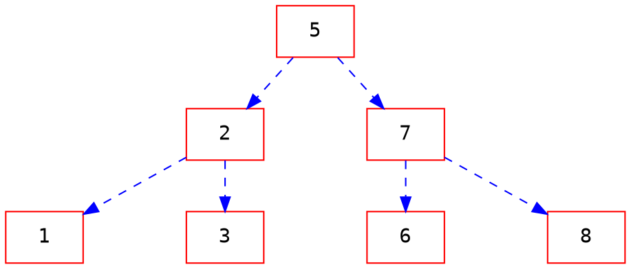
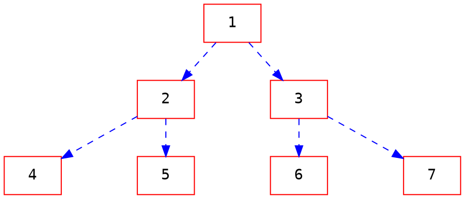
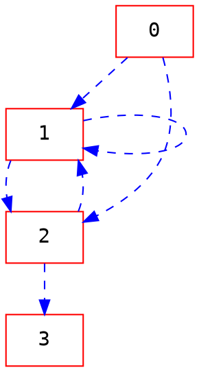

# 50 Interview Questions


###### tags: `interview` `algorithm`

[reference book](https://www.byte-by-byte.com/wp-content/uploads/2019/01/50-Coding-Interview-Questions.pdf)


## Guide 
1. Understand the problem
2. Find a brute force solution
3. Optimize the brute force solution
4. Code the solution
5. Test the solution


## Problems

### Array 1-14
1. Median of Arrays*

Question: Find the median of two sorted arrays.
```
arr1 = [1,3,5]
arr2 = [2,4,6]
median(arr1, arr2)  = 3.5
```

- Leetcode 4. Median of Two Sorted Arrays

[ans](https://www.byte-by-byte.com/median/)

2. 0-1 Knapsack*
Question: Given a list of items with values and weights, as well as a max weight, find the maximum value you can generate from items where the sum of the weights is less than the max.
```
items = {(w:1, v:6), (w:2, v:10), (w:3, v:12)}
maxWeight = 5
knapsack(items, maxWeight) = 22
```
[ans](https://www.byte-by-byte.com/01knapsack/)

3. Matrix product
Question: Given a matrix, find the path from top left to bottom right with the greatest product by moving only down and right.

```
[1, 2, 3]
[4, 5, 6]
[7, 8, 9]
1 ‐> 4 ‐> 7 ‐> 8 ‐> 9
2016
[‐1, 2, 3]
[4, 5, ‐6]
[7, 8, 9]
‐1 ‐> 4 ‐> 5 ‐> ‐6 ‐> 9
1080
```

- Leetcode 1594. Maximum Non Negative Product in a Matrix

[ans](https://www.byte-by-byte.com/matrixproduct/)


4. Find Duplicates
Question: Given an array of integers where each value 1 <= x <= len(array), write a function that finds all the duplicates in the array.

```

dups([1, 2, 3]) = []
dups([1, 2, 2]) = [2]
dups([3, 3, 3]) = [3]
dups([2, 1, 2, 1]) = [1, 2]

```

- Leetcode 287. Find the Duplicate Number
- Leetcode 442. Find All Duplicates in an Array

[ans](https://www.byte-by-byte.com/findduplicates/)

5. Consecutive Array*

Question: Given an unsorted array, find the length of the longest sequence of consecutive numbers in the array.

```
consecutive([4, 2, 1, 6, 5]) = 3, [4, 5, 6]
consecutive([5, 5, 3, 1]) = 1, [1], [3], or [5]

```

- Leetcode 674. Longest Continuous Increasing Subsequence
- Leetcode 523. Continuous Subarray Sum

[ans](https://www.byte-by-byte.com/consecutivearray/)


6. Zero Matrix
Question: Given a boolean matrix, update it so that if any cell is true, all the cells in that row and column are true.

```
[true,  false, false]      [true,  true,  true ]
[false, false, false]  ‐>  [true,  false, false]
[false, false, false]      [true,  false, false]
```

- Leetcode 733. Flood Fill
- Leetcode 73. Set Matrix Zeroes

[ans](https://www.byte-by-byte.com/zeromatrix/)

7. Square Submatrix
Question: Given a 2D array of 1s and 0s, find the largest square  subarray of all 1s.

```
Given a 2D array of 1s and 0s, find the largest square subarray of all 1s.
```

- Leetcode 221. Maximal Square
- Leetcode 1277. Count Square Submatrices with All Ones

[ans](https://www.byte-by-byte.com/squaresubmatrix/)


8. Merge K Arrays*
Question: Given k sorted arrays, merge them into a single sorted array.

```
merge({{1, 4, 7},{2, 5, 8},{3, 6, 9}}) = {1, 2, 3, 4, 5, 6, 7, 8, 9}
```
>Hint: priority queue store K array  information

[ans](https://www.byte-by-byte.com/mergekarrays/)


9. Matrix Search

Question: Given an n x m array where all rows and columns are in sorted order, write a function to determine whether the array contains an element x.

```
contains([1,  2,  3,  4]
         [5,  6,  7,  8]
         [9, 10, 11, 12]) = True

```
>Hint : start from 左上或右下角

- Leetcode 74. Search a 2D Matrix
- Leetcode 240. Search a 2D Matrix II


[ans](https://www.byte-by-byte.com/matrixsearch/)


10. Merge Arrays
Given 2 sorted arrays, A and B, where A is long enough to hold the contents of A and B, write a function to copy the contents of B into A without using any buffer or additional memory.


```
A = {1,3,5,0,0,0}
B = {2,4,6}
mergeArrays(A, B)
A = {1,2,3,4,5,6}
```

- Leetcode 88. Merge Sorted Array

[ans](https://www.byte-by-byte.com/mergearrays/)

11. Zero Sum Subarray*
Question: Given an array, write a function to find any subarray that sums to zero, if one exists.


```
zeroSum({1, 2, ‐5, 1, 2, ‐1}) = [2, ‐5, 1, 2]
```

>Hint: hash table, sum mapping index  

- Leetcode 560. Subarray Sum Equals K

[ans](https://www.byte-by-byte.com/zerosum/)

12. Permutations*
Question: Write a function that returns all permutations of a given list.

```
permutations({1, 2, 3})
[1, 2, 3]
[1, 3, 2]
[2, 1, 3]
[2, 3, 1]
[3, 1, 2]
[3, 2, 1]
```
>Hint : swap

- Leetcode 46. Permutations
- Leetcode 47. Permutations II
[ans](https://www.byte-by-byte.com/permutations/)


13. N Stacks*
Question: Implement N > 0 stacks using a single array to store all stack data (you may use auxiliary arrays in your stack object, but all of the objects in all of the stacks must be in the same array). No stack should be full unless the entire array is full.

```
N = 3;
capacity = 10;
Stacks stacks = new Stacks(N, capacity);
stacks.put(0, 10);
stacks.put(2, 11);
stacks.pop(0) = 10;
stacks.pop(2) = 11;

```

>Hint: 用3個array維護

[ans](https://www.byte-by-byte.com/nstacks/)


14. Anagrams

Question: Given two strings, write a function to determine whether they are anagrams.

```
isAnagram("", "") = true
isAnagram("A", "A") = true
isAnagram("A", "B") = false
isAnagram("ab", "ba") = true
isAnagram("AB", "ab") = true
```

- Leetcode 242. Valid Anagram
- Leetcode 49. Group Anagrams

[ans](https://www.byte-by-byte.com/anagrams/)


### Graph 15-16

15. Build Order*

Question: Given a list of packages that need to be built and the dependencies for each package, determine a valid order in which to build the packages.

```
0:
1: 0
2: 0
3: 1, 2
4: 3
output: 0, 1, 2, 3, 4
```

[ans](https://www.byte-by-byte.com/buildorder/)

16. Shortest Path*

Question: Given a directed graph, find the shortest path between two nodes if one exists.


```
shortestPath(2, 3) = 2 ‐> 5 ‐> 4 ‐> 3

```

### Recursion 17-26

17. Random Binary Tree

Question: Implement a binary tree with a method getRandomNode() that returns a random node.


```
getRandomNode() = 5
getRandomNode() = 8
getRandomNode() = 1
```


[ans](https://www.byte-by-byte.com/randombinarytree/)

18. Lowest Common Ancestor*
Question: Given two nodes in a binary tree, write a function to find the lowest common ancestor.



```

lcs(4, 3) = 1
lcs(6, 7) = 3
```

- Leetcode 236. Lowest Common Ancestor of a Binary Treeans

[ans](https://www.byte-by-byte.com/lowestcommonancestor/)


19. Sum*

Question: Given two integers, write a function to sum the numbers without using any arithmetic operators.

>Hint: xor
- Leetcode 371. Sum of Two Integers


[ans](https://www.byte-by-byte.com/sum/)


20. Reverse Stack*

Question: Given a stack, reverse the items without creating any additional data structures.

```
reverse(1‐>2‐>3) = 3‐>2‐>1
```

[ans](https://www.byte-by-byte.com/reversestack/)

21. Tree to Doubly Linked List*

Question: Given a tree, write a function to convert it into a circular doubly linked list from left to right by only modifying the existing pointers.


```
<‐ 4 <‐> 2 <‐> 5 <‐> 1 <‐> 6 <‐> 3 <‐> 7 ‐>

```

- Leetcode 426. Convert Binary Search Tree to Sorted Doubly Linked List 

[ans](https://www.byte-by-byte.com/treetolist/)


22. Longest Consecutive Branch*

Question: Given a tree, write a function to find the length of the longest branch of nodes in increasing consecutive order.




```
length = 3
```

- Leetcode 298. Binary Tree Longest Consecutive Sequence 
- Leetcode 549. Binary Tree Longest Consecutive Sequence II 

[ans](https://www.byte-by-byte.com/longestbranch/)


23. Print Reversed Linked List

Question: Given a linked list, write a function that prints the nodes of the list in reverse order.

```
printReversedList(1 ‐> 2 ‐> 3)
3
2
1
```
- Leetcode 206. Reverse Linked List


[ans](https://www.byte-by-byte.com/printreversedlist/)


24. Balanced Binary Tree*

Question: Given a binary tree, write a function to determine whether the tree is balanced.

- Leetcode 110. Balanced Binary Tree


[ans](https://www.byte-by-byte.com/balancedtree/)


25. Binary Search Tree Verification*

Question: Given a binary tree, write a function to test if the tree is a binary search tree.


- Leetcode 98. Validate Binary Search Tree


[ans](https://www.byte-by-byte.com/binarysearchtree/)

26. Smallest Change*

Question: Given an input amount of change x, write a function to determine the minimum number of coins required to make that amount of change.

- Leetcode 322. Coin Change
>Hint: dp

[ans](https://www.byte-by-byte.com/smallestchange/)


### Stack 27-31

27. Inorder Traversal*

Question: Given a binary search tree, print out the elements of the tree in order without using recursion.

>Hint: stack

- Leetcode 94. Binary Tree Inorder Traversal
- Leetcode 144. Binary Tree Preorder Traversal
- Leetcode 145. Binary Tree Postorder Traversal


[ans](https://www.byte-by-byte.com/inordertraversal/)


28. Sort Stacks*

Question: Given a stack, sort the elements in the stack using one additional stack.

```
sort([1, 3, 2, 4]) = [1, 2, 3, 4]
```
>Hint: two level loop
[ans](https://www.byte-by-byte.com/sortstacks/)

29. Stack from Queues

Question: Implement a LIFO stack with basic functionality (push and pop) using FIFO queues to store the data.


- Leetcode 225. Implement Stack using Queues
- Leetcode 232. Implement Queue using Stacks

[ans](https://www.byte-by-byte.com/stackfromqueues/)


30. Palindromes

Question: Given a linked list, write a function to determine whether the list is a palindrome.

```
palindrome(1 ‐> 2 ‐> 3) = false
palindrome(1 ‐> 2 ‐> 1) = true

```


- Leetcode 234. Palindrome Linked List
- Leetcode 9. Palindrome Number
- Leetcode 125. Valid Palindrome


[ans](https://www.byte-by-byte.com/palindromes/)


31. Max Stacks*

Question: Implement a LIFO stack that has a push(), pop(), and max() function, where max() returns the maximum value in the stack. All of these functions should run in O(1) time.

```
push(1)
max() = 1
push(2)
max() = 2
push(1)
max() = 2
pop() = 1
max() = 2
pop() = 2
max() = 1
```

- Leetcode 155. Min Stack

[ans](https://www.byte-by-byte.com/maxstack/)


### Bit Manipulation 32-37

32. Two Missing Numbers*

Question: Given an array containing all the numbers from 1 to n except two, find the two missing numbers.

```
missing([4, 2, 3]) = 1, 5
```

- Leetcode 268. Missing Number
- Leetcoede 

[ans](https://www.byte-by-byte.com/twomissingnumbers/)


33. Big Int Modules*
Question: Given a list of bytes a, each representing one byte of a larger integer (ie. {0x12, 0x34, 0x56, 0x78}represents the integer 0x12345678), and an integer b, find a % b.

```
mod({0x03, 0xED}, 10) = 5
```

[ans](https://www.byte-by-byte.com/bigintmod/)


34. Swap Variables*
Question: Given two integers, write a function that swaps them without using any temporary variables.

```java
public void swap(int x, int y) {
    x = x + y;
    y = x - y;
    x = x - y;
}
 
public void swap(int x, int y) {
    x = x ^ y;
    y = x ^ y;
    x = x ^ y;
}
```

[ans](https://www.byte-by-byte.com/swapvariables/)


35. Gray Code*
Question: Given two integers, write a function to determine whether or not their binary representations differ by a single bit.

```
gray(0, 1) = true
gray(1, 2) = false
```

> Hint: (x & (x-1)) == 0
- Leetcode 89. Gray Code

[ans](https://www.byte-by-byte.com/graycode/)


36. Rotate Bits*
Question: Given a number, write a function to rotate the bits (ie circular shift).
```
rotate(0xFFFF0000, 8) = 0x00FFFF00
rotate(0x13579BDF, 12) = 0xBDF13579
rotate(0b10110011100011110000111110000000, 17) =
0b00011111000000010110011100011110

```

[ans](https://www.byte-by-byte.com/rotatebits/)


37. Number of Ones in a Binary Number

Question: Given an integer, write a function to compute the number of ones in the binary representation of the number.

- Leetcode 191. Number of 1 Bits


[ans](https://www.byte-by-byte.com/onesinbinary/)

### Linked List 38-44

38. Linked List Cycles

Question: Given a linked list, determine whether it contains a cycle.


>Hint: slow-fast pointer 

- Leetcode 141. Linked List Cycle
- Leetcode 142. Linked List Cycle II

[ans](https://www.byte-by-byte.com/listcycles/)


39. Random Linked List*
Question: Given a linked list where each node has two pointers, one to the next node and one to a random node in the list, clone the linked list.

- Leetcode 138. Copy List with Random Pointer

[ans](https://www.byte-by-byte.com/randomlinkedlist/)

40. Dedup Linked List*

Question: Given an unsorted linked list, write a function to remove all the duplicates.

```
dedup(1 ‐> 2 ‐> 3 ‐> 2 ‐> 1) = 1 ‐> 2 ‐> 3
```
- LeetCode 1836. Remove Duplicates From an Unsorted Linked List

[ans](https://www.byte-by-byte.com/deduplinkedlist/)


41. Split a Linked List*

Question: Given a linked list, write a function to split the list into two equal halves.

```
divide(1 ‐> 2 ‐> 3 ‐> 4) = 1 ‐> 2, 3 ‐> 4
divide(1 ‐> 2 ‐> 3 ‐> 4 ‐> 5) = 1 ‐> 2 ‐> 3, 4 ‐> 5

```

- Leetcode 725. Split Linked List in Parts

[ans](https://www.byte-by-byte.com/splitlinkedlist/)


42. Nth to the Last Element*
Question: Given a linked list, and an input n, write a function that returns the nth-to-last element of the linked list.

> Hint: two pointer
- Leetcode 19. Remove Nth Node From End of List


[ans](https://www.byte-by-byte.com/nthtolastelement/)


43. Three Sum


Question: Given a list of integers, write a function that returns all sets of 3 numbers in the list, a, b, and c, so that a + b + c == 0.


```
threeSum({‐1, 0, 1, 2, ‐1, ‐4})
[‐1, ‐1, 2]
[‐1, 0, 1]
```

- Leetcode 15. 3Sum
- Leetcode 18. 4Sum


[ans](https://www.byte-by-byte.com/threesum/)

44. Tree Level Order

Question: Given a tree, write a function that prints out the nodes of the tree in level order.


```
traverse(tree) = 1 2 3 4 5 6 7
```

- Leetcode 102. Binary Tree Level Order Traversal
- Leetcode 107. Binary Tree Level Order Traversal II


[ans](https://www.byte-by-byte.com/treelevelorder/)


### String 45-50

45. Autocomplete*
Question: Write an autocomplete class that returns all dictionary words with a given prefix.

```
dict:   {"abc", "acd", "bcd", "def", "a", "aba"}
prefix: "a" ‐> "abc", "acd", "a", "aba"
prefix: "b" ‐> "bcd"
```

- Leetcode 642. Design Search Autocomplete System 

[ans](https://www.byte-by-byte.com/autocomplete/)


46. String Deletion*
Question: Given a string and a dictionary HashSet, write a function to determine the minimum number of characters to delete to make a word.

```
dictionary: [“a”, “aa”, “aaa”]
query: “abc”
output: 2
```
[ans](https://www.byte-by-byte.com/stringdeletion/)


47. Longest Common Substring
Question: Given two strings, write a function that returns the longest common substring.

```
longestSubstring("ABAB", "BABA") = "ABA"
```

- Leetcode 1143. Longest Common Subsequence

[ans](https://www.byte-by-byte.com/longestsubstring/)


48. String Compression*


Question: Given a string, write a function to compress it by shortening every sequence of the same character to that character followed by the number of repetitions. If the compressed string is longer than the original, you should return the original string.

```
compress(“a”) = "a"
compress(“aaa”) = "a3"
compress(“aaabbb”) = "a3b3"
compress(“aaabccc”) = "a3b1c3"
```

- Leetcode 443. String Compression


[ans](https://www.byte-by-byte.com/stringcompression/)

49. Fibonacci Number
Question: Given an integer n, write a function to compute the nth Fibonacci number.

```
fibonacci(1) = 1
fibonacci(5) = 5
fibonacci(10) = 55
```

- Leetcode 509. Fibonacci Number

[ans](https://www.byte-by-byte.com/fibonacci/)

50. Priority Queue

Question: Implement a Priority Queue


[ans](https://www.byte-by-byte.com/priorityqueue/)